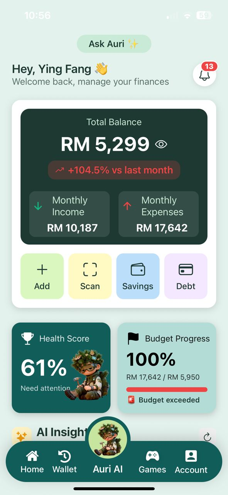
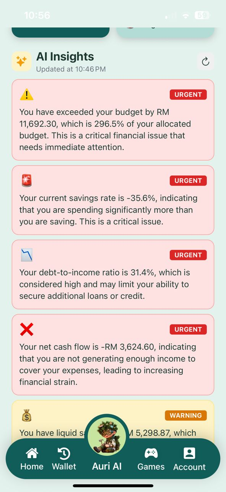
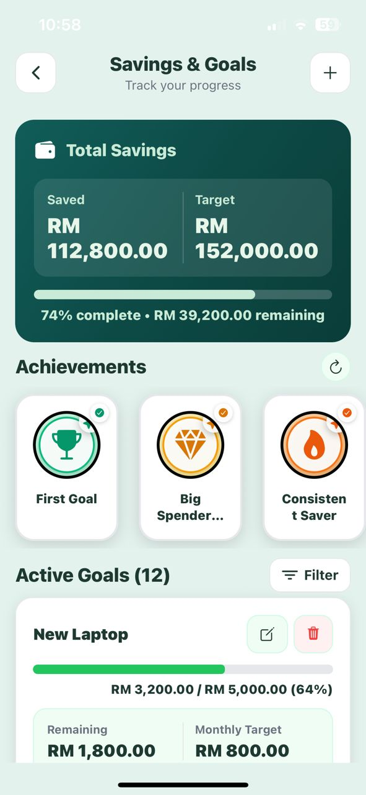
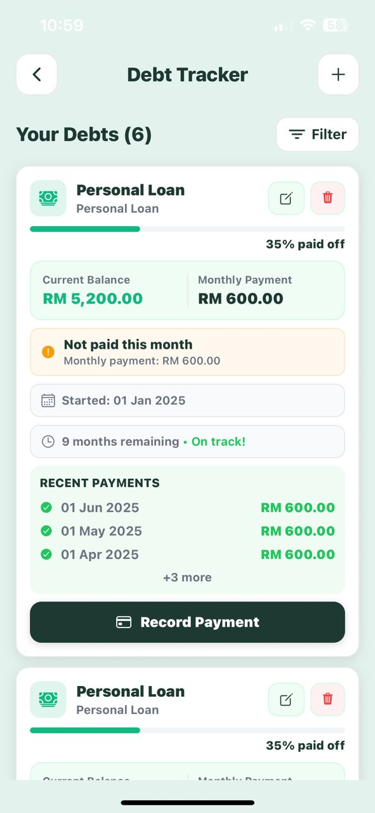
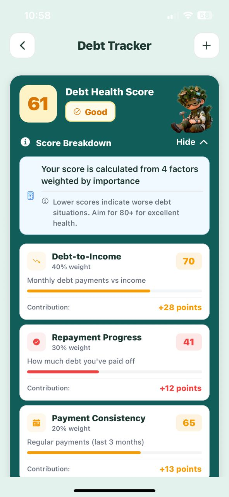

# 💰 Personal Finance Management System

## 🚀 Overview
A web application that helps users manage their finances, track debts, and improve financial health through interactive dashboards.

---

## ✨ Features
- 📊 AI Insights dashboard  
- 🎯 Savings goal tracking  
- 💳 Debt tracker  
- 📈 Economics trading simulation game 
- ❤️ Debt health score  

---

## 📸 UI Screenshots

### 🏠 Homepage

  

<i>Main dashboard overview of user financial status</i>

---

### 📊 AI Insights

  

<i>AI-driven insights to help users understand spending patterns</i>

---

### 🎯 Savings Goal

  

<i>Track and manage personal savings goals effectively</i>

---

### 💳 Debt Tracker

  

<i>Monitor outstanding debts and repayment progress</i>

---

### ❤️ Debt Health Score

  

<i>Visual score representing overall debt health</i>

---

### 📈 Trading Game

  

<i>Simulated trading environment to practice financial decisions</i>

---
